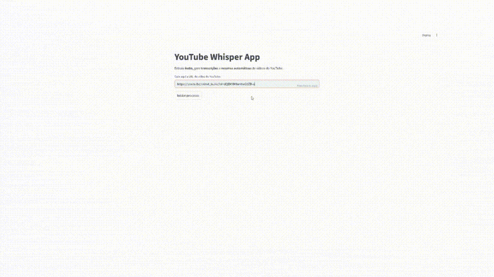

# YouTube Transcriber & Summarizer

**Transforme vídeos do YouTube em transcrições e resumos automáticos, com um clique!**  

Este app combina **Whisper (OpenAI)** e **Modelos Hugging Face** para extrair áudio, gerar transcrições multilíngues e produzir resumos inteligentes diretamente via **Streamlit**.

---

## Demonstração

---

## Funcionalidades

    ✅ Download automático do áudio de vídeos do YouTube  
    ✅ Transcrição em múltiplos idiomas (Whisper)  
    ✅ Tradução automática para português 🇧🇷  
    ✅ Geração de resumo inteligente com modelos da Hugging Face  
    ✅ Geração de *insights automáticos* com base no texto  
    ✅ Interface simples via Streamlit  
    ✅ Registro de logs de execução  

---

## Tecnologias Utilizadas

    | Categoria | Ferramenta |
    |------------|-------------|
    | Transcrição | [OpenAI Whisper](https://github.com/openai/whisper) |
    | NLP / Summarization | [Hugging Face Transformers](https://huggingface.co/models) |
    | Tradução | [Googletrans](https://pypi.org/project/googletrans/) |
    | Download de vídeos | [yt-dlp](https://github.com/yt-dlp/yt-dlp) |
    | Interface | [Streamlit](https://streamlit.io) |
    | Log e pipeline | Python + NLTK + datetime |

---

## Estrutura do Projeto

    youtube_transcriber/
    │
    ├── app/
    │ ├── app.py # Interface Streamlit
    │
    ├── youtube_whisper_pipeline.py # Funções principais (download, transcrição, resumo, tradução)
    │
    ├── requirements.txt # Bibliotecas do projeto
    │
    ├── .gitignore # Ignora venv, cache e arquivos temporários
    │
    └── README.md # Este arquivo

---

## Instalação e Uso

1. **Clone o repositório:**
   
    git clone https://github.com/gutosavi/youtube_transcriber.git
    cd youtube_transcriber

2. **Crie e ative o ambiente virtual**
   
    python -m venv venv
    venv\Scripts\activate   # Windows

3. **Instale as dependências**

    pip install -r requirements.txt

4. **Execute o app**

    streamlit run app/app.py

---

## Exemplo de Uso

    - Insira o link de um vídeo do YouTube
    - O app faz o download do áudio
    - Transcreve com Whisper
    - Traduz (se for outro idioma)
    - Resume o texto com modelo da Hugging Face
    - Mostra os insights automáticos

---

## Próximos Passos

    - Adicionar suporte a legendas (.srt)

    - Permitir upload de arquivos de áudio direto

    - Otimizar o pipeline para vídeos longos

    - Disponibilizar API pública

---

## Autor

    Gustavo Savi
    Junior Data Analyst & Former AI Engineer | Python | NLP | IA Aplicada

---

## Licença

    Este projeto é de código aberto sob a licença MIT.
    Sinta-se à vontade para usar, modificar e contribuir!

